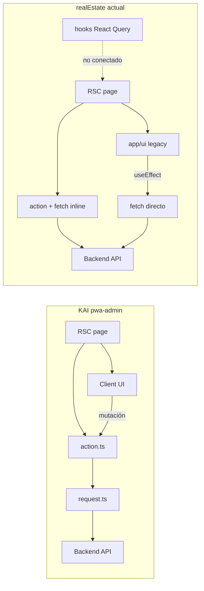

# Comparación arquitectónica — KAI `pwa-admin` vs realEstate backoffice

> **Estado:** Análisis de referencia  
> **Fecha:** Julio 2026  
> **Complementa:**  
> - [`MIGRACION_ARQUITECTURA_KAI.md`](./MIGRACION_ARQUITECTURA_KAI.md) — ecosistema, mail  
> - [`PLAN_PASO_A_PASO_SPLIT.md`](./PLAN_PASO_A_PASO_SPLIT.md) — pasos ejecutables del split  
> **Referencia KAI:** `/Users/felipe/dev/kai/pwa-admin`

Este documento detalla la arquitectura **frontend del admin**: capas, data fetching, UI compartida y estado de migración. Sirve como guía concreta para la Fase 0 del plan de migración (consolidar backoffice antes de separarlo en `pwa-backoffice`).

---

## Tabla de contenidos

1. [Veredicto](#1-veredicto)
2. [Comparación lado a lado](#2-comparación-lado-a-lado)
3. [Qué hace bien KAI (y conviene copiar)](#3-qué-hace-bien-kai-y-conviene-copiar)
4. [Estado de migración realEstate](#4-estado-de-migración-realestate)
5. [Flujos de datos](#5-flujos-de-datos)
6. [Qué adoptar de KAI (priorizado)](#6-qué-adoptar-de-kai-priorizado)
7. [Resumen](#7-resumen)

---

## 1. Veredicto

**KAI `pwa-admin` está varios niveles por encima** en separación de responsabilidades, convenciones y escala — pero no es perfecto: la documentación exige 5 capas y la mayoría de features usan solo 2–3.

**realEstate backoffice** tiene la misma *intención* documentada (`.github/copilot-instructions.md`), pero está a **~35% migrado** con dos capas de UI paralelas y tres formas distintas de llamar al backend.

| | KAI `pwa-admin` | realEstate backoffice |
|--|-----------------|----------------------|
| **Nota arquitectura** | 8/10 — sólido, documentado, escala bien | 4/10 — buena intención, migración a medias |
| **Fortaleza principal** | Una sola vía al backend (`*.request.ts`) | Server actions ya adoptadas en 18/20 pages |
| **Debilidad principal** | Drift doc vs código (~84% sin use cases) | UI duplicada, 3 patrones HTTP, layout client |
| **Esfuerzo para paridad** | — | ~2–3 sprints de consolidación antes del split |

---

## 2. Comparación lado a lado

| Dimensión | KAI `pwa-admin` | realEstate backoffice |
|-----------|-----------------|----------------------|
| **Escala** | 189 páginas, 88 features, 97 actions | 20 páginas, 7 features, 17 actions |
| **Estructura app** | `app/(app)/` = rutas; `src/features/` = integración | `app/backOffice/` = rutas + UI legacy mezclada |
| **Capas** | UI → Action → (UseCase) → Request → API | UI → Action **o** useEffect **o** fetch inline |
| **HTTP al backend** | Solo `*.request.ts` (~100 archivos) | 3 patrones: actions, services duplicados, fetch en page |
| **React Query** | Instalado, **0 usos** — RSC + actions | Instalado, hooks definidos pero **no conectados a pages** |
| **UI compartida** | `@kai/ui` (~521 imports) + `src/shared/` ERP | `shared/components/ui/` interno |
| **Auth** | NextAuth → backend login; token en requests | NextAuth + JWE; roles solo en middleware |
| **Layout** | RSC `(app)/layout.tsx` — session + company | Client layout con `useEffect` para identity |
| **Docs enforcement** | `AGENTS.md` + `.instructions/webadmin.instruction` | `.github/copilot-instructions.md` (aspiracional) |
| **Tests frontend** | 4 specs puntuales | Sin tests frontend backoffice |

### Conteos realEstate (backoffice)

| Ítem | Valor |
|------|-------|
| `page.tsx` en `app/backOffice/` | 20 |
| `*.action.ts` en `features/backoffice/` | 17 |
| `useEffect(` en `app/backOffice/` | 37 ocurrencias / 25 archivos |
| `loading.tsx` | 6 de 20 (30%) |
| Componentes en `app/backOffice/**/ui/` | ~74 |
| Componentes en `features/backoffice/**/components/` | ~75 |
| Dominios feature | 7 (cms, contracts, documents, multimedia, notifications, properties, users) |

### Conteos KAI (`pwa-admin`)

| Ítem | Valor |
|------|-------|
| `page.tsx` | ~189 |
| Features en `src/features/` | ~88 |
| `*.action.ts` | ~97 |
| `*.request.ts` | ~100 |
| Features con stack completo (use case + domain) | ~14 (~16%) |
| Imports de `@kai/ui` | ~521 |

---

## 3. Qué hace bien KAI (y conviene copiar)

### 3.1 Separación ruta vs feature (clara)

```
pwa-admin/
├── app/(app)/sales/customers/
│   ├── page.tsx          ← RSC: carga inicial
│   └── ui/               ← componentes de pantalla
└── src/features/sales-customers/
    ├── actions/
    ├── infrastructure/customer.request.ts   ← ÚNICO lugar con fetch
    └── types/
```

En realEstate hoy:

```
app/backOffice/contracts/sales/
├── page.tsx              ← llama actions ✅
└── ui/ContractsGrid.tsx  ← UI legacy ❌ (duplicada en features/)

features/backoffice/contracts/
├── actions/              ✅
├── components/ContractsGrid.tsx  ← existe pero no siempre se usa
└── pages/SalesContractsPage.tsx  ← creada pero NO conectada
```

**~50/50 de UI duplicada** — componentes en `app/backOffice/ui/` y en `features/backoffice/components/` en paralelo.

### 3.2 Flujo de datos: RSC-first, sin React Query

KAI eligió un patrón consistente:

```
page.tsx (RSC)
  → listCustomersForPage()     // server action
    → CustomerRequest.list()   // infrastructure
      → fetch backend + Bearer token
  → props a Client Component
  → mutación → action → revalidatePath() + router.refresh()
```

TanStack Query está instalado pero **no se usa**. Todo pasa por Server Actions.

realEstate tiene **tres caminos en paralelo**:

| Camino | Dónde | Estado |
|--------|-------|--------|
| RSC → action → fetch inline | 18 páginas | Parcialmente correcto |
| Client + `useEffect` → fetch | 2 páginas CMS + layout | Legacy |
| Hooks React Query → services | `features/*/hooks/` | Definidos pero **desconectados de routes** |

### 3.3 Capa `infrastructure/*.request.ts` (regla de oro)

KAI concentra el HTTP en request objects que:

- Leen `getServerSession(authOptions)`
- Agregan `Authorization: Bearer` (+ headers de tenant en KAI)
- Hacen `fetch` con `cache: "no-store"`

**Prohibido:** `fetch` desde componentes cliente hacia el backend.

realEstate hoy:

- Actions hacen fetch directamente (~17 archivos, 100+ calls)
- Services duplican `apiFetch` por módulo
- `lib/api/client.ts` y `fetchWithAuthCheck` existen pero casi no se usan
- Dashboard hace fetch inline en la page

### 3.4 Capas documentadas vs reales (KAI también tiene drift)

KAI documenta 5 capas:

```
Action → UseCase → Domain (Zod) → Request → API
```

En la práctica:

- **~16% features** tienen stack completo (`settings-branches`, `settings-users`, etc.)
- **~84%** van directo: `action → request` (ej. `sales-customers`, `hr-employees`)

realEstate no tiene use cases ni domain layer — solo actions + types + validation Zod.

**Conclusión:** no hacen falta las 5 capas en todo; sí hace falta **una capa HTTP única** (`*.request.ts`) y **cero fetch en UI**.

### 3.5 Auth y sesión

| Aspecto | KAI `pwa-admin` | realEstate |
|---------|-----------------|------------|
| Login | `app/page.tsx` → NextAuth credentials | `/portal` (portal y backoffice comparten) |
| Cookie | `next-auth.session.kai-admin` (aislada) | Cookie compartida con portal |
| Token en API | `session.user.accessToken` en requests | `session.accessToken` (JWE) |
| Expiración | RSC layout detecta 401 → `SessionExpiredScreen` | Redirect genérico en middleware |
| Roles backend | `TenantGuard` + decorators | Solo `JwtAuthGuard` |

### 3.6 Layout y shell

**KAI** — layout autenticado es **Server Component**: session, company context, shell.

**realEstate** — layout backoffice es **Client Component** (`app/backOffice/layout.tsx`):

- `useSession()`, `useEffect()` para logo/identity
- Menú hardcodeado en el layout
- Fuerza fetch de identidad en cliente y bloquea optimizaciones RSC

### 3.7 UI compartida

| KAI | realEstate |
|-----|------------|
| `@kai/ui` — paquete monorepo versionado | `shared/components/ui/` — carpeta interna |
| `CollectionPageLayout`, `DotProgress`, `Dialog` estandarizados | Componentes similares pero sin paquete extraíble |
| `src/shared/components/` — solo widgets ERP-específicos | Todo mezclado en `shared/` |
| `/design-system/*` — showcase vivo | Sin showcase |

### 3.8 Enforcement

KAI tiene reglas explícitas en `AGENTS.md`:

- No fetch cliente al backend
- Referencia CRUD: `settings/branches/`
- Modales solo con `@kai/ui Dialog`
- Loading solo con `DotProgress`
- Patrón Person multi-rol documentado

realEstate tiene `.github/copilot-instructions.md` pero el código **no lo cumple del todo** — hay imports invertidos (`features/` → `app/backOffice/ui/`).

---

## 4. Estado de migración realEstate

### Matriz de páginas (20 total)

| Estado | Páginas | % |
|--------|---------|---|
| ✅ Migradas (action + features UI) | 7 | 35% |
| ⚠️ Híbridas (action + `app/ui` legacy) | 11 | 55% |
| ❌ Legacy (client + useEffect) | 2 | 10% |
| ❌ Dashboard (fetch inline) | 1 | — |

**Migradas:** agents, administrators, slider, articles, testimonials, documentTypes, properties/sales

**Legacy / híbrido:** contracts (todo), properties/rent, community, ourTeam, notifications, aboutUs, identity, dashboard

### Señales de deuda

| Problema | Impacto |
|----------|---------|
| 37 `useEffect` en 25 archivos backoffice | Hidratación lenta, doble fetch |
| 6/20 `loading.tsx` (30%) | UX de carga inconsistente |
| 3 patrones HTTP | Bugs de auth, difícil de testear |
| `features/` importa `app/` (varios archivos) | Dependencia invertida |
| Componentes duplicados (AdminCard, AgentCard…) | Mantenimiento doble |
| Layout client-side | Pierde ventajas RSC |

### Dependencias invertidas (olores)

Feature code que importa rutas/UI de `app/` (no debería existir):

- `features/backoffice/users/components/administrators/AdminCard.tsx` → `app/backOffice/users/ui/...`
- `features/backoffice/contracts/components/documentTypes/DocumentTypesContent.tsx` → app
- `features/backoffice/properties/components/dialogs/createProperty/CreateProperty.tsx` → app

### Capas por dominio (realEstate)

| Dominio | Actions | Hooks RQ | Services | UI principal |
|---------|---------|----------|----------|--------------|
| users | ✅ | Definidos | ✅ | features (agents/admins) |
| cms | ✅ (6 files) | Definidos | ✅ | Mixto |
| properties | ✅ | Definidos | ✅ | Mixto (sales ✅, rent ⚠️) |
| contracts | ✅ | Definidos | ✅ | Mayoría en `app/ui` |
| notifications | ✅ | Definidos | ✅ | `app/ui` |
| multimedia | ✅ | Definidos | ✅ | Embebido en flujos |
| documents | Parcial | Definidos | ✅ | Scaffold / parcial |

---

## 5. Flujos de datos



### Flujo objetivo (post Fase 0)

```
UI (RSC page + client components)
  → Server Actions (*.action.ts)
    → Use cases (solo si hay lógica compleja)
      → Infrastructure (*.request.ts) — ÚNICO fetch al backend
        → Nest API
```

Mutaciones: `action` → `revalidatePath` / `router.refresh()` (patrón KAI). Elegir **RSC + actions** *o* React Query — no ambos desconectados.

---

## 6. Qué adoptar de KAI (priorizado)

### Prioridad 1 — antes de separar apps (Fase 0)

1. **Crear `infrastructure/*.request.ts`** por feature — mover todo fetch de actions ahí
2. **Eliminar UI duplicada** en `app/backOffice/ui/` — conectar pages a `features/backoffice/components/`
3. **Convertir layout a RSC** — identity/logo vía server action, no `useEffect`
4. **Conectar o eliminar hooks React Query** — un solo camino de datos

### Prioridad 2 — al extraer `pwa-backoffice`

5. **Mover features a `src/features/`** (patrón KAI: integración fuera de `app/`)
6. **Extraer `@realestate/ui`** desde `shared/components/ui/`
7. **Crear `AGENTS.md`** con referencia CRUD canónica (ej. `users/agents/`)
8. **Login propio** en `app/page.tsx` con cookie aislada

### Prioridad 3 — madurez

9. Use cases solo donde haya lógica compleja (contracts, properties)
10. `loading.tsx` en todas las páginas
11. Session expired screen (como KAI)
12. Ruta showcase de design system

### Criterio de salida Fase 0 (frontend)

- [ ] Cero `fetch` en componentes cliente hacia el backend
- [ ] Toda HTTP en `*.request.ts` (o equivalente único)
- [ ] Páginas backoffice usan UI de `features/`, no `app/**/ui/` legacy
- [ ] Layout backoffice es RSC (o al menos sin fetch de identity en `useEffect`)
- [ ] Un solo patrón de data fetching documentado y aplicado
- [ ] Sin imports `features/` → `app/backOffice/`

---

## 7. Resumen

**La buena noticia:** realEstate ya tiene `features/backoffice/` con actions, validation y types. El gap no es empezar de cero — es **terminar la migración** y **unificar la capa HTTP** siguiendo el patrón que KAI resolvió con `*.request.ts`.

**Primer paso concreto:** priorizar request layer + eliminar UI duplicada en las 11 páginas híbridas y las 2 legacy, antes de cualquier split a `pwa-backoffice`.

### Relación con el plan de migración

| Documento | Alcance |
|-----------|---------|
| [`MIGRACION_ARQUITECTURA_KAI.md`](./MIGRACION_ARQUITECTURA_KAI.md) | Monorepo, split portal/backoffice, auth backend, mail, fases 0–5 |
| [`PLAN_PASO_A_PASO_SPLIT.md`](./PLAN_PASO_A_PASO_SPLIT.md) | Pasos: `core`, `portal`, `backoffice`, usuarios, `@realestate/ui` |
| **Este documento** | Detalle de capas frontend admin; checklist Fase 0 UI/HTTP |

---

## Referencias

| Recurso | Ubicación |
|---------|-----------|
| Plan de migración ecosistema | `doc/MIGRACION_ARQUITECTURA_KAI.md` |
| Copilot instructions | `.github/copilot-instructions.md` |
| Frontend architecture audit | `.FRONTEND_ARCHITECTURE_AUDIT.md` |
| Design system | `.github/DESIGN_SYSTEM.md` |
| KAI pwa-admin AGENTS | `/Users/felipe/dev/kai/pwa-admin/AGENTS.md` |
| KAI feature de referencia (CRUD) | `/Users/felipe/dev/kai/pwa-admin/src/features/settings-branches/` |
| KAI página de referencia | `/Users/felipe/dev/kai/pwa-admin/app/(app)/settings/branches/` |
