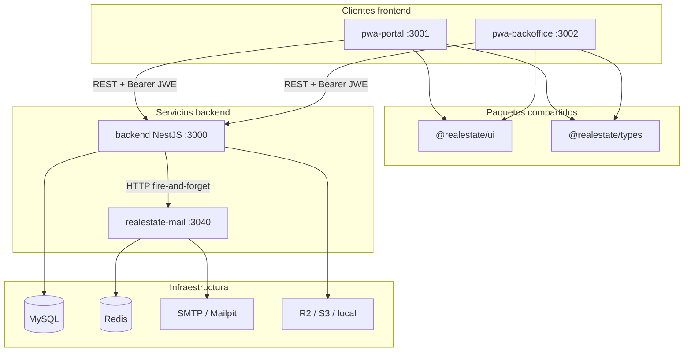
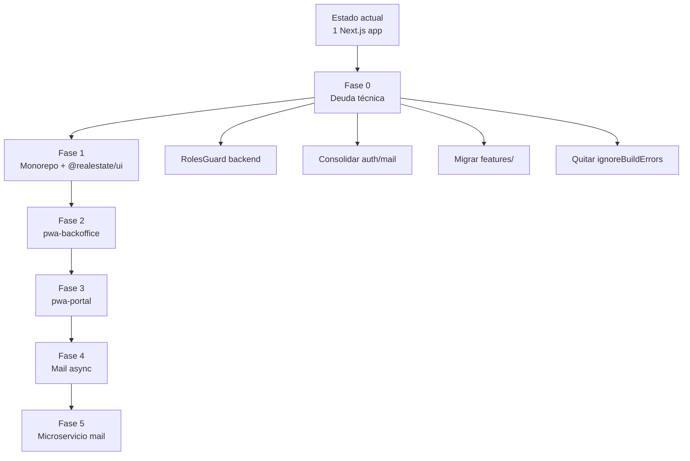

# Diseño de migración arquitectónica — alineación con KAI

> **Estado:** Propuesta de diseño  
> **Fecha:** Julio 2026  
> **Referencia:** [KAI Platform](/Users/felipe/dev/kai) — monorepo con backend standalone, apps frontend independientes y microservicio de correo.

Este documento describe el diseño objetivo y el plan de migración para evolucionar **realEstatePlatform-3** desde un monorepo laxo con una sola app Next.js hacia una arquitectura comparable a KAI: múltiples clientes desplegables, paquetes compartidos versionados, auth reforzada en backend y correo asíncrono desacoplado.

> **Complementos:**  
> - Capas frontend admin vs KAI `pwa-admin` → [`COMPARACION_PWA_ADMIN_VS_BACKOFFICE.md`](./COMPARACION_PWA_ADMIN_VS_BACKOFFICE.md)  
> - Plan operativo paso a paso (split, `core`, usuarios, `@realestate/ui`) → [`PLAN_PASO_A_PASO_SPLIT.md`](./PLAN_PASO_A_PASO_SPLIT.md)  
> - Migración MySQL → PostgreSQL → [`MIGRACION_MYSQL_A_POSTGRES.md`](./MIGRACION_MYSQL_A_POSTGRES.md)

---

## Tabla de contenidos

1. [Estado actual vs objetivo](#1-estado-actual-vs-objetivo)
2. [Comparación con KAI](#2-comparación-con-kai)
3. [Arquitectura objetivo](#3-arquitectura-objetivo)
4. [Separación portal / backoffice](#4-separación-portal--backoffice)
5. [Consideraciones de auth y seguridad](#5-consideraciones-de-auth-y-seguridad)
6. [Sistema de correo](#6-sistema-de-correo)
7. [Plan de migración por fases](#7-plan-de-migración-por-fases)
8. [Checklist de madurez](#8-checklist-de-madurez)
9. [Riesgos y mitigaciones](#9-riesgos-y-mitigaciones)
10. [Referencias internas](#10-referencias-internas)

---

## 1. Estado actual vs objetivo

### Estado actual

```
realEstatePlatform-3/
├── backend/              → NestJS API (puerto 3000)
└── frontend/             → Next.js único (puerto 3001)
    ├── app/portal/       → Sitio público + usuarios COMMUNITY
    └── app/backOffice/   → Admin + agentes
```

| Aspecto | Situación actual |
|---------|------------------|
| Monorepo | Dos carpetas independientes, sin `package.json` root ni workspaces |
| Frontend | Una app Next.js; separación portal/backoffice por prefijo de ruta |
| Shared UI | `frontend/shared/components/ui/` — interno, no versionado como paquete |
| Auth roles | Middleware frontend; backend valida JWT sin guards sistemáticos de rol |
| Email | In-process (`MailModule` + Nodemailer síncrono) |
| Env | `.env` manual por subproyecto |
| Migración features | Parcial — lógica aún en `app/*/ui/` |

### Estado objetivo

```
realEstatePlatform-3/
├── backend/                    → NestJS API standalone (fuera del workspace npm)
├── pwa-portal/                 → Sitio público + community (puerto 3001)
├── pwa-backoffice/             → Admin + agentes (puerto 3002)
├── packages/
│   ├── ui/                     → @realestate/ui — design system
│   └── types/                  → @realestate/types — DTOs compartidos (opcional)
├── services/
│   └── realestate-mail/        → Microservicio de correo (fase 3)
├── envs/                       → Matriz central + script de sync
└── scripts/
    └── dev-all.sh              → Orquestación local
```

---

## 2. Comparación con KAI

| Dimensión | KAI | realEstate (actual) | realEstate (objetivo) |
|-----------|-----|---------------------|------------------------|
| Forma del repo | Monorepo parcial con npm workspaces | Dos carpetas sueltas | Workspaces para PWAs + packages |
| Apps frontend | Varias Next.js independientes | Una app con `/portal` + `/backOffice` | `pwa-portal` + `pwa-backoffice` |
| Backend | NestJS standalone | NestJS standalone | Sin cambio estructural |
| Shared UI | `@kai/ui` | Carpeta interna | `@realestate/ui` |
| Email | Microservicio `kai-mail` (BullMQ + Redis) | In-process Nodemailer | Fase 2: BullMQ in-process → Fase 3: microservicio |
| Auth staff | JWT + NextAuth por app, roles en backend | NextAuth + JWE, roles en middleware | RolesGuard backend + NextAuth por app |
| Env | `envs/` + `sync-dev-envs.sh` | Manual | Matriz centralizada |
| Capas frontend | UI → Actions → Use cases → Infrastructure | Documentado pero incompleto | Enforced antes/durante el split |

### Principio rector de KAI

> **Una API, muchos clientes.** Cada PWA es un deploy independiente con su propio puerto, cookies de sesión y bundle. El backend no asume un único frontend.

---

## 3. Arquitectura objetivo

### Diagrama de componentes



### Puertos de desarrollo (propuesta)

| Servicio | Puerto dev | Notas |
|----------|------------|-------|
| backend | 3000 | Sin cambio |
| pwa-portal | 3001 | Ex-`frontend`, rutas `/portal/*` → `/` |
| pwa-backoffice | 3002 | Rutas `/backOffice/*` → `/` |
| realestate-mail | 3040 | Fase 3 |
| Mailpit (dev) | 8025 (UI), 1025 (SMTP) | Testing visual de emails |

### Root `package.json` (workspaces)

```json
{
  "name": "realestate-platform",
  "private": true,
  "workspaces": [
    "packages/*",
    "pwa-portal",
    "pwa-backoffice"
  ],
  "scripts": {
    "dev": "./scripts/dev-all.sh",
    "env:dev": "./envs/sync-dev-envs.sh"
  }
}
```

> **Nota:** El backend permanece **fuera** del workspace npm (patrón KAI). Tiene su propio `node_modules` y ciclo de release independiente.

---

## 4. Separación portal / backoffice

### Mapeo de apps

| App KAI | App realEstate propuesta | Audiencia | Rutas actuales → nuevas |
|---------|--------------------------|-----------|-------------------------|
| `pwa-eshop` | `pwa-portal` | Público + COMMUNITY | `/portal/*` → `/*` |
| `pwa-admin` | `pwa-backoffice` | ADMIN + AGENT | `/backOffice/*` → `/*` |

### Qué migra a cada app

**pwa-portal**

- `app/portal/**`
- `features/portal/**`
- `features/shared/auth/**` (login, registro, verify, reset password)
- `features/shared/locations/**`, `predictions/**`, `common/**`
- Providers globales del portal (splash, slider, cookie consent)

**pwa-backoffice**

- `app/backOffice/**`
- `features/backoffice/**`
- `features/shared/audit/**`, `propertyTypes/**`
- Auth staff (mismo backend, distinta config NextAuth)

**Compartido (paquetes)**

- `shared/components/ui/` → `@realestate/ui`
- Tipos de API → `@realestate/types` (opcional, fase posterior)

### Regla de aislamiento

```
pwa-portal     ✗  no importa  ✗  pwa-backoffice
       ↘                    ↙
         @realestate/ui
         @realestate/types
```

Las apps **no** deben importarse entre sí. Todo código compartido vive en `packages/`.

### Sesiones y cookies separadas

Cada app tiene su propia instancia NextAuth con cookie distinta:

| App | Cookie NextAuth | `pages.signIn` |
|-----|-----------------|----------------|
| pwa-portal | `next-auth.session.portal` | `/login` |
| pwa-backoffice | `next-auth.session.backoffice` | `/login` |

Ambas llaman al mismo endpoint backend (`POST /auth/sign-in`) pero mantienen sesiones independientes. Un usuario staff logueado en backoffice no queda automáticamente logueado en el portal.

### CORS backend

Actualmente el backend permite solo `localhost:3001`. Con dos apps:

```typescript
// backend/src/main.ts
cors: {
  origin: [
    'http://localhost:3001',           // pwa-portal
    'http://localhost:3002',           // pwa-backoffice
    process.env.PORTAL_URL,
    process.env.BACKOFFICE_URL,
  ],
  credentials: true,
}
```

### Deploy

| App | URL prod (ejemplo) | Restricción |
|-----|-------------------|-------------|
| pwa-portal | `https://tudominio.cl` | Público |
| pwa-backoffice | `https://admin.tudominio.cl` | Opcional: IP allowlist / VPN |

El backoffice despliega sin arrastrar el bundle del portal (propiedades públicas, slider, blog, etc.).

### Patrón de capas frontend (obligatorio post-split)

```
UI (componentes)
  ↓
Server Actions (*.action.ts)
  ↓
Use cases (*.usecase.ts) — opcional en features simples
  ↓
Domain (Zod schemas, types)
  ↓
Infrastructure (*.request.ts) — única capa que hace fetch al backend
```

**Prohibido:** `fetch` directo desde componentes cliente hacia el backend.

---

## 5. Consideraciones de auth y seguridad

### Gap crítico actual

La separación de roles ocurre principalmente en `frontend/middleware.ts`:

- ADMIN/AGENT en `/portal` → redirect a `/backOffice`
- COMMUNITY en `/backOffice` → redirect a `/portal`

El backend usa `JwtAuthGuard` pero **no** tiene guards sistemáticos de rol. Con dos apps independientes, cualquier token válido podría invocar endpoints admin vía API directa.

### Objetivo: RolesGuard en backend

```typescript
// Ejemplo objetivo
@UseGuards(JwtAuthGuard, RolesGuard)
@Roles('ADMIN', 'AGENT')
@Controller('properties')
export class PropertiesController { ... }
```

| Endpoint | Roles permitidos |
|----------|------------------|
| CRUD propiedades (admin) | ADMIN, AGENT |
| CMS (slides, team, articles) | ADMIN |
| Usuarios (administrators, agents) | ADMIN |
| Portal público (listado, detalle) | Público / COMMUNITY |
| Favoritos, mis propiedades | COMMUNITY (autenticado) |

### Consolidación auth backend

Hoy existen flujos duplicados entre `modules/auth` y `modules/users`:

| Flujo | auth | users |
|-------|------|-------|
| Login | `POST /auth/sign-in` | `LoginUseCase` (interno) |
| Registro community | `POST /auth/register` | `CreateCommunityUserUseCase` |
| Verificar email | `POST /auth/verify-email` | `VerifyUserEmailUseCase` |
| Reenviar verificación | `POST /auth/resend-verification-email` | Controller duplicado en `/auth` |

**Acción:** unificar en un solo módulo (`auth`) con use-cases claros; `users` expone solo gestión de perfiles/admin.

### JWE duplicado

Existen dos implementaciones de JWE:

- `backend/src/modules/auth/jwe/`
- `backend/src/modules/auth/infrastructure/jwe/`

**Acción:** conservar una sola (preferir `infrastructure/jwe/` según DDD) y eliminar la otra.

---

## 6. Sistema de correo

### Estado actual

```
Auth / Notifications / PasswordRecovery
         ↓ (await — bloquea request)
    MailService → NestMailAdapter → Nodemailer SMTP
         ↓
    templates/*.hbs (Handlebars)
```

**Ubicación:** `backend/src/modules/mail/`

| Aspecto | Estado |
|---------|--------|
| Provider activo | `@nestjs-modules/mailer` + Nodemailer |
| Templates activos | 9 archivos `.hbs` |
| Legacy | `EmailService` en notifications — **no registrado**, templates `.html` duplicados |
| Async / cola | No |
| Reintentos | No |
| Dev testing | `jsonTransport: true` en test; sin Mailpit |

### Templates activos

| Template | Trigger |
|----------|---------|
| `welcome.hbs` | Registro |
| `email-verification.hbs` | Verificación de email |
| `password-reset.hbs` | Recuperación de contraseña |
| `interest-confirmation.hbs` | Interés en propiedad |
| `admin-notification.hbs` | Notificación admin |
| `property-request-admin.hbs` | Solicitud publicación (admin) |
| `property-request-user.hbs` | Solicitud publicación (usuario) |
| `property-status-change.hbs` | Cambio de estado de propiedad |

### Comparación con KAI (kai-mail)

```
Backend → HTTP POST (fire-and-forget) → kai-mail:5040
                                              ↓
                                         BullMQ (Redis)
                                              ↓
                                         Nodemailer → SMTP
                                              ↓
                                         Handlebars templates
```

| Capacidad | KAI | realEstate actual |
|-----------|-----|-------------------|
| Desacoplamiento | Microservicio | In-process |
| No bloquea HTTP | Sí | No |
| Reintentos | BullMQ | No |
| Idempotencia | `jobId` | No |
| Dev visual | Mailpit | No |
| Escalado independiente | Sí | No |

### Roadmap de correo

#### Fase 1 — Limpieza (bajo esfuerzo)

- [ ] Eliminar `EmailService` legacy y templates `.html`
- [ ] Unificar consumidores en `MailModule`
- [ ] Agregar Mailpit en `docker-compose` de desarrollo
- [ ] Quitar logs de config SMTP al startup

#### Fase 2 — Async in-process (medio esfuerzo)

- [ ] Introducir BullMQ + Redis en el backend
- [ ] `MailService.send()` encola job y retorna inmediatamente
- [ ] Worker procesa envíos con reintentos (3 intentos, backoff exponencial)
- [ ] Dead letter queue para fallos persistentes

#### Fase 3 — Microservicio (nivel KAI)

- [ ] Extraer `services/realestate-mail/`
- [ ] Cliente HTTP en backend (`RealEstateMailClient`) — fire-and-forget, timeout 5s
- [ ] Templates migrados al microservicio
- [ ] Deploy independiente; escala aparte del API

### Variables de entorno (mail)

```bash
# Fase 1-2 (in-process)
MAIL_HOST=smtp.gmail.com
MAIL_PORT=587
MAIL_USER=
MAIL_PASS=
MAIL_FROM=noreply@tudominio.cl

# Fase 3 (microservicio)
REALESTATE_MAIL_URL=http://localhost:3040
REALESTATE_MAIL_API_KEY=
REDIS_URL=redis://localhost:6379
```

---

## 7. Plan de migración por fases

### Diagrama de fases



### Fase 0 — Deuda técnica (prerrequisito)

**Objetivo:** resolver gaps de seguridad y arquitectura antes de dividir apps.

**Estimación:** 1–2 sprints

| Tarea | Prioridad | Archivos clave |
|-------|-----------|----------------|
| Implementar `RolesGuard` + decorator `@Roles()` | Alta | `backend/src/modules/auth/` |
| Consolidar auth/users (eliminar duplicados) | Alta | `modules/auth`, `modules/users` |
| Eliminar JWE duplicado | Media | `auth/jwe/` vs `auth/infrastructure/jwe/` |
| Terminar migración a `features/` | Alta | `app/*/ui/` → `features/` |
| Eliminar `EmailService` legacy | Media | `notifications/application/email.service.ts` |
| Quitar `typescript.ignoreBuildErrors: true` | Alta | `frontend/next.config.ts` |
| Unificar API client (`lib/api/client.ts` vs `apiClient.ts`) | Media | `frontend/lib/` |

**Criterio de salida:** backend rechaza requests admin sin rol; frontend compila sin errores TS; no hay código mail legacy.

### Fase 1 — Monorepo + paquete UI

**Objetivo:** sentar bases del monorepo sin cambiar comportamiento visible.

**Estimación:** 1 sprint

| Tarea | Detalle |
|-------|---------|
| Crear `package.json` root con workspaces | `packages/*`, apps futuras |
| Extraer `@realestate/ui` | Desde `frontend/shared/components/ui/` |
| Configurar `transpilePackages` en Next | Ambas PWAs futuras |
| Crear `envs/` + `sync-dev-envs.sh` | Matriz centralizada |
| Crear `scripts/dev-all.sh` | Levanta backend + frontend actual |

**Criterio de salida:** `@realestate/ui` importable desde el frontend actual sin regresiones visuales.

### Fase 2 — Extraer pwa-backoffice

**Objetivo:** app Next.js independiente para admin y agentes.

**Estimación:** 2 sprints

| Tarea | Detalle |
|-------|---------|
| Copiar `frontend/` → `pwa-backoffice/` | Base inicial |
| Mover rutas `app/backOffice/**` → `app/**` | `/backOffice/properties` → `/properties` |
| Mover `features/backoffice/**` | Sin cambios de lógica |
| Configurar NextAuth propio | Cookie `next-auth.session.backoffice` |
| Actualizar CORS backend | Agregar puerto 3002 |
| Eliminar rutas portal y middleware de roles | Ya no necesario entre apps |
| Actualizar `dev-all.sh` | Backend + portal + backoffice |

**Criterio de salida:** backoffice funciona en `:3002` de forma independiente; portal sigue en `:3001` sin rutas admin.

### Fase 3 — Renombrar frontend → pwa-portal

**Objetivo:** portal limpio sin código admin.

**Estimación:** 1 sprint

| Tarea | Detalle |
|-------|---------|
| Renombrar `frontend/` → `pwa-portal/` | |
| Eliminar `app/backOffice/**` | Ya vive en pwa-backoffice |
| Mover rutas `app/portal/**` → `app/**` | `/portal/properties` → `/properties` |
| Eliminar middleware de redirección por rol | Solo auth de community |
| Configurar NextAuth portal | Cookie `next-auth.session.portal` |
| Actualizar env y docs | |

**Criterio de salida:** dos apps desplegables por separado; ninguna importa código de la otra.

### Fase 4 — Mail async (in-process)

**Objetivo:** envíos no bloqueantes con reintentos.

**Estimación:** 1 sprint

| Tarea | Detalle |
|-------|---------|
| Agregar Redis al docker-compose dev | |
| Integrar BullMQ en backend | Cola `mail-send` |
| Refactor `MailService` → enqueue | Fire-and-forget desde use-cases |
| Mailpit en dev | UI en `:8025` |
| Tests de cola | Job encolado, worker procesa, retry en fallo |

**Criterio de salida:** registro de usuario responde HTTP 201 antes de que SMTP complete; reintentos funcionan.

### Fase 5 — Microservicio mail (opcional)

**Objetivo:** paridad con `kai-mail`.

**Estimación:** 1–2 sprints

| Tarea | Detalle |
|-------|---------|
| Crear `services/realestate-mail/` | NestJS + BullMQ + Nodemailer |
| Migrar templates `.hbs` | Al microservicio |
| `RealEstateMailClient` en backend | HTTP POST, timeout 5s |
| Dockerfile + deploy | Puerto 3040 |
| Eliminar BullMQ del backend | Solo cliente HTTP |

**Criterio de salida:** backend no tiene dependencia directa de Nodemailer; mail escala independiente.

---

## 8. Checklist de madurez

### Prioridad alta (antes del split)

- [ ] `RolesGuard` en backend — no confiar solo en middleware frontend
- [ ] Consolidar `auth` vs `users` — un solo flujo por operación
- [ ] Terminar migración `features/` — sacar lógica de `app/*/ui/`
- [ ] Limpiar mail legacy — un solo stack de templates
- [ ] Quitar `typescript.ignoreBuildErrors: true`
- [ ] Eliminar JWE duplicado

### Prioridad media (durante el split)

- [ ] Root `package.json` con workspaces
- [ ] Extraer `@realestate/ui`
- [ ] Dos apps Next.js con NextAuth separado
- [ ] Matriz `envs/` + script sync
- [ ] `scripts/dev-all.sh`
- [ ] CORS multi-origen en backend
- [ ] Unificar API client frontend

### Prioridad baja (post-split / madurez)

- [ ] Microservicio de mail
- [ ] Paquete `@realestate/types`
- [ ] CI/CD por app (GitHub Actions)
- [ ] Notificaciones in-app desacopladas del email
- [ ] Migraciones TypeORM formales (reemplazar `synchronize: true` en dev)
- [ ] Eliminar `.git` anidados en backend/frontend

---

## 9. Riesgos y mitigaciones

| Riesgo | Impacto | Mitigación |
|--------|---------|------------|
| Split sin RolesGuard | Alto — API admin expuesta | Fase 0 obligatoria antes de Fase 2 |
| Duplicación de código al copiar apps | Medio | Extraer `@realestate/ui` en Fase 1 |
| Regresiones auth (cookies cruzadas) | Alto | Cookies distintas + dominios separados en prod |
| Bundle grande en backoffice | Bajo | Split elimina código portal del bundle admin |
| Email perdido en fallo SMTP | Medio | Fase 4 (cola + reintentos) |
| Migración features incompleta | Medio | No splitear hasta criterio Fase 0 |
| Env desincronizado entre apps | Bajo | `envs/sync-dev-envs.sh` desde Fase 1 |
| Tipos frontend/backend divergentes | Medio | `@realestate/types` en fase posterior |

---

## 10. Referencias internas

| Documento | Ubicación | Relación |
|-----------|-----------|----------|
| **Comparación pwa-admin vs backoffice** | [`doc/COMPARACION_PWA_ADMIN_VS_BACKOFFICE.md`](./COMPARACION_PWA_ADMIN_VS_BACKOFFICE.md) | Capas frontend admin, request layer, matriz de migración Fase 0 |
| **Plan paso a paso (split)** | [`doc/PLAN_PASO_A_PASO_SPLIT.md`](./PLAN_PASO_A_PASO_SPLIT.md) | Rename `core`, apps `portal`/`backoffice`, usuarios, `@realestate/ui`, workspaces |
| **Migración MySQL → Postgres** | [`doc/MIGRACION_MYSQL_A_POSTGRES.md`](./MIGRACION_MYSQL_A_POSTGRES.md) | Persistencia a largo plazo alineada con KAI |
| Copilot instructions | `.github/copilot-instructions.md` | Convenciones DDD backend + features frontend |
| Frontend refactoring roadmap | `FRONTEND_REFACTORING_ROADMAP.md` | Migración UI a shared (complementa Fase 0-1) |
| Frontend architecture audit | `.FRONTEND_ARCHITECTURE_AUDIT.md` | Estado de migración features |
| Design system | `.github/DESIGN_SYSTEM.md` | Base para `@realestate/ui` |
| Middleware audit | `MIDDLEWARE_AUDIT_REPORT.md` | Auth por rol — a reemplazar con split + RolesGuard |
| Async upload strategy | `backend/ASYNC_UPLOAD_STRATEGY.md` | Patrón async existente (referencia para mail) |

### Referencia externa

| Recurso | Ubicación |
|---------|-----------|
| KAI arquitectura | `/Users/felipe/dev/kai/docs/project/ARQUITECTURA_Y_ECOSISTEMA.md` |
| KAI pwa-admin | `/Users/felipe/dev/kai/pwa-admin/` (+ `AGENTS.md`) |
| KAI kai-mail | `/Users/felipe/dev/kai/services/kai-mail/` |
| KAI env matrix | `/Users/felipe/dev/kai/envs/shared.env.example` |

---

## Resumen ejecutivo

**Lo que KAI tiene y realEstate necesita:**

1. Apps frontend deployables por separado (no solo rutas)
2. Paquete UI compartido versionado
3. Email async desacoplado con cola y reintentos
4. Auth de roles en backend, no solo frontend
5. Env centralizada con sync automático

**Lo que realEstate ya tiene a favor:**

- DDD por módulos en backend
- Separación conceptual portal/backoffice en `features/`
- MailModule con Handlebars (base sólida)
- NextAuth + JWE (más seguro que JWT plano)

**Primer paso concreto:** Fase 0 — implementar `RolesGuard` en backend y completar migración a `features/` (detalle UI/HTTP en [`COMPARACION_PWA_ADMIN_VS_BACKOFFICE.md`](./COMPARACION_PWA_ADMIN_VS_BACKOFFICE.md)). Sin esto, el split multiplica la deuda en lugar de resolverla.
