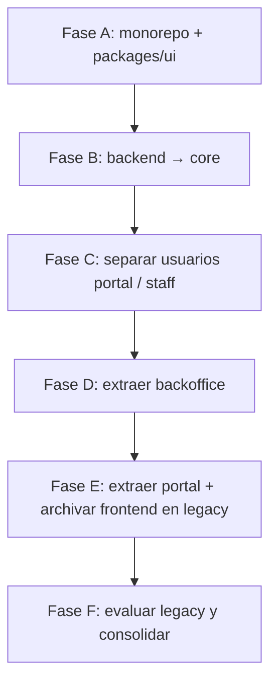
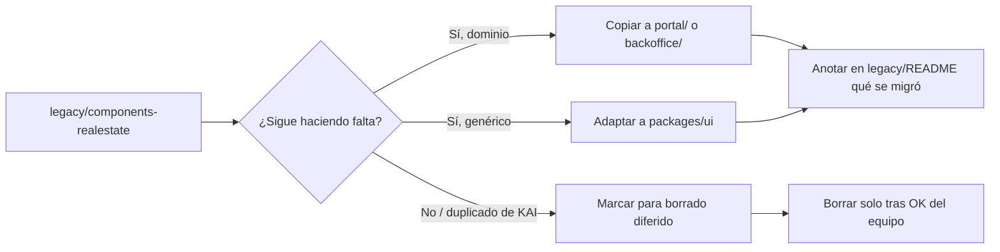

# Plan paso a paso — migración arquitectónica con split

> **Estado:** Plan operativo  
> **Fecha:** Julio 2026  
> **Complementa:**  
> - [`MIGRACION_ARQUITECTURA_KAI.md`](./MIGRACION_ARQUITECTURA_KAI.md) — diseño de ecosistema  
> - [`COMPARACION_PWA_ADMIN_VS_BACKOFFICE.md`](./COMPARACION_PWA_ADMIN_VS_BACKOFFICE.md) — capas frontend admin  
> - [`MIGRACION_MYSQL_A_POSTGRES.md`](./MIGRACION_MYSQL_A_POSTGRES.md) — persistencia Postgres  

Este documento define **pasos ejecutables** para llegar a la estructura objetivo: `core` (API), `portal` + `backoffice` (apps Next.js), `packages/ui` compartido, **node_modules compartidos** vía npm workspaces, y **entidades/auth de usuarios separadas** entre portal y backoffice.

---

## Tabla de contenidos

1. [Estructura objetivo](#1-estructura-objetivo)
2. [Principios no negociables](#2-principios-no-negociables)
3. [Mapa de fases](#3-mapa-de-fases)
4. [Fase A — Preparación monorepo y `packages/ui`](#fase-a--preparación-monorepo-y-packagesui)
5. [Fase B — Renombrar `backend` → `core`](#fase-b--renombrar-backend--core)
6. [Fase C — Separar entidades y auth de usuarios](#fase-c--separar-entidades-y-auth-de-usuarios)
7. [Fase D — Extraer `backoffice`](#fase-d--extraer-backoffice)
8. [Fase E — Extraer `portal` y archivar en `legacy/`](#fase-e--extraer-portal-y-archivar-en-legacy)
9. [Fase F — Consolidación, evaluación legacy y limpieza](#fase-f--consolidación-evaluación-legacy-y-limpieza)
10. [Checklist final](#10-checklist-final)
11. [Orden de commits sugerido](#11-orden-de-commits-sugerido)

---

## 1. Estructura objetivo

```
realEstatePlatform-3/
├── package.json                 ← workspaces (portal, backoffice, packages/*)
├── package-lock.json            ← un solo lockfile para apps + packages
├── node_modules/                ← compartido entre portal, backoffice y @realestate/ui
│
├── core/                        ← ex-backend (NestJS) — FUERA del workspace npm
│   ├── package.json             ← npm install propio (como KAI backend)
│   ├── src/
│   └── node_modules/
│
├── portal/                      ← sitio público + usuarios community
│   ├── package.json             ← workspace member
│   ├── app/                     ← rutas / (ex /portal/*)
│   └── src/features/
│
├── backoffice/                  ← admin + agentes
│   ├── package.json             ← workspace member
│   ├── app/                     ← rutas / (ex /backOffice/*)
│   └── src/features/
│
├── packages/
│   └── ui/                      ← @realestate/ui (estructura tipo @kai/ui)
│       ├── package.json
│       ├── src/
│       │   ├── index.ts
│       │   ├── components/      ← primitivoes compartidos (copiados/adaptados desde KAI)
│       │   ├── hooks/
│       │   └── theme/
│       ├── DESIGN-SYSTEM.md
│       └── README.md
│
├── legacy/                      ← NO borrar el pasado: archivo para evaluación
│   ├── README.md                ← reglas: no importar desde apps activas
│   ├── frontend/                ← snapshot completo del frontend pre-split
│   └── components-realestate/   ← componentes propios del dominio (extraídos para revisar)
│
├── envs/
├── scripts/
│   └── dev-all.sh
└── doc/
```

### Qué pasa con las carpetas antiguas

| Antes | Después | Nota |
|-------|---------|------|
| `backend/` | `core/` | Rename in-place (sigue activo) |
| `frontend/` | **`legacy/frontend/`** | **No se elimina** — se archiva tras el split |
| `frontend/app/portal/` | `portal/app/` (activo) + copia en legacy | Código vivo en `portal/` |
| `frontend/app/backOffice/` | `backoffice/app/` (activo) + copia en legacy | Código vivo en `backoffice/` |
| `frontend/shared/components/ui/` (primitivos) | `packages/ui/` (activo) + residual en legacy | Base KAI + adaptaciones |
| Componentes especializados realEstate | Migrar a app **o** dejar en `legacy/components-realestate/` hasta evaluar | Ver § Legacy |

> **Regla:** tras el split, las apps activas son solo `portal/` y `backoffice/`. Lo antiguo vive en `legacy/` para comparar, recuperar y decidir — **nunca** como dependencia de runtime.

### Node modules compartidos

Como en KAI (`package.json` root con `workspaces`):

```json
{
  "name": "realestate-platform",
  "private": true,
  "workspaces": [
    "packages/*",
    "portal",
    "backoffice"
  ]
}
```

- **Un solo** `npm install` en la raíz instala deps de `portal`, `backoffice` y `packages/ui`.
- React, Next, NextAuth, etc. se hoist-ean a `node_modules/` raíz (compartidos).
- `core/` **no** entra al workspace: tiene su propio `npm install` (evita acoplar Nest/TypeORM al ciclo de vida de Next).

Cada app Next debe:

```ts
// next.config.ts
transpilePackages: ["@realestate/ui"],
outputFileTracingRoot: monorepoRoot,
```

y alias a `packages/ui/src` (mismo patrón que KAI `pwa-admin/next.config.ts`).

---

## 2. Principios no negociables

1. **Tras el split, las apps activas son `portal/` y `backoffice/`.** La carpeta `frontend/` **no se borra**: se mueve a `legacy/frontend/`.
2. **`backend/` se renombra a `core/`.** Actualizar scripts, CI, docs, paths de env.
3. **Usuarios portal ≠ usuarios backoffice** a nivel de dominio, auth y cookies (ver Fase C).
4. **UI compartida solo vía `@realestate/ui`.** Las apps no se importan entre sí.
5. **Una sola capa HTTP por app:** `*.request.ts` → backend `core`.
6. **Workspaces npm** para compartir `node_modules` entre portal, backoffice y packages.
7. **`legacy/` es solo referencia.** Ninguna app activa (`portal`, `backoffice`, `packages/ui`, `core`) puede importar desde `legacy/`. Si hace falta un componente, se copia/migra explícitamente a su destino.

---

## 3. Mapa de fases



| Fase | Entregable | Riesgo |
|------|------------|--------|
| A | Root workspaces + `@realestate/ui` usable | Bajo |
| B | `core/` renombrado, CI/scripts OK | Bajo |
| C | Auth/entidades staff vs community separados | Alto |
| D | `backoffice/` independiente en :3002 | Medio |
| E | `portal/` independiente; `frontend/` → `legacy/frontend/` | Medio |
| F | Evaluar legacy, migrar componentes dominio, AGENTS.md, envs | Bajo |

**No saltar Fase C antes del split de apps.** Sin separación de usuarios, las cookies y endpoints se mezclan entre portal y backoffice.

---

## Fase A — Preparación monorepo y `packages/ui`

### A.1 Crear root workspace

**Pasos:**

1. Crear `/package.json` en la raíz del repo con workspaces (aún sin mover apps):

```json
{
  "name": "realestate-platform",
  "private": true,
  "packageManager": "npm@10.9.2",
  "engines": { "node": ">=20" },
  "workspaces": [
    "packages/*"
  ],
  "scripts": {
    "ui:typecheck": "npm run typecheck -w @realestate/ui",
    "install:apps": "npm install"
  }
}
```

2. Crear carpeta `packages/`.
3. No tocar aún `frontend/` ni `backend/`.

**Criterio de salida:** `npm install` en raíz no rompe nada; `packages/` existe.

---

### A.2 Crear `packages/ui` (estructura tipo `@kai/ui`)

**Referencia a copiar/adaptar:** `/Users/felipe/dev/kai/packages/ui`

Estructura mínima:

```
packages/ui/
├── package.json          # name: "@realestate/ui"
├── tsconfig.json
├── README.md
├── DESIGN-SYSTEM.md
├── src/
│   ├── index.ts          # re-exports públicos
│   ├── types.ts
│   ├── components/       # Button, Dialog, DataGrid, TextField, …
│   ├── hooks/            # useCoarsePointer, etc.
│   └── theme/
│       └── tokens.css
└── scripts/              # opcionales: audit/migrate imports
```

**`packages/ui/package.json` (modelo):**

```json
{
  "name": "@realestate/ui",
  "version": "0.1.0",
  "private": true,
  "type": "module",
  "main": "./src/index.ts",
  "types": "./src/index.ts",
  "exports": {
    ".": "./src/index.ts",
    "./components/*": "./src/components/*",
    "./hooks/*": "./src/hooks/*",
    "./theme/*": "./src/theme/*"
  },
  "peerDependencies": {
    "next": "^16.0.0",
    "react": "^19.0.0",
    "react-dom": "^19.0.0"
  },
  "scripts": {
    "typecheck": "tsc --noEmit"
  }
}
```

### A.3 Qué copiar desde KAI vs qué conservar de realEstate

| Fuente | Acción |
|--------|--------|
| `kai/packages/ui/src/components/*` | **Copiar** como base del design system compartido (Button, Dialog, DataGrid, TextField, Select, Alert, Badge, Tabs, Switch, NumberStepper, DotProgress, Skeleton, LoadingState, layouts, etc.) |
| `kai/packages/ui/src/theme/tokens.css` | Copiar y adaptar tokens a marca realEstate |
| `kai/packages/ui/src/index.ts` | Adaptar exports a `@realestate/ui` |
| `frontend/shared/components/ui/*` | Migrar **solo** lo que no exista en KAI o sea dominio inmobiliario |

**No meter en `@realestate/ui` (dejar en cada app o archivar en legacy hasta evaluar):**

| Componente actual | Destino preferido | Si aún no se decide |
|-------------------|-------------------|---------------------|
| `TopBar`, `SideBar` | `backoffice/src/shared/` o `portal/src/shared/` | `legacy/components-realestate/` |
| `LoginForm`, `RegisterForm` | por app (auth distinto) | legacy hasta adaptar |
| `PropertyFilterSale`, `PropertyFilterRent`, `PropertyCardSkeleton` | `portal/` | **prioridad legacy** — propios de realEstate |
| `ContactDialog`, `SplashScreen`, `Logo` | `portal/` | legacy si hay duda |
| `FileUploader` / multimedia domain-heavy | genérico → ui; acoplado a API → feature | legacy mientras se clasifica |
| Cards de propiedad, grids CMS legacy, formularios portal | app correspondiente | legacy si hay duplicados |

### A.4 Cablear el frontend actual a `@realestate/ui` (antes del split)

Mientras aún exista `frontend/` activo:

1. Agregar dependencia `"@realestate/ui": "*"` en `frontend/package.json` **o** incluir temporalmente `frontend` en workspaces.
2. En `next.config.ts`: `transpilePackages: ["@realestate/ui"]` + alias a `packages/ui/src`.
3. Migrar imports gradualmente:

```ts
// antes
import { Button } from "@/shared/components/ui/Button";

// después
import { Button } from "@realestate/ui";
```

4. Cuando un **primitivo** esté 100% en `@realestate/ui`, **no borrar de inmediato**:
   - Dejar la copia en `frontend/shared/...` hasta el archivado en `legacy/`, **o**
   - Mover ya a `legacy/components-realestate/primitives-old/` si molesta el tree.
5. Componentes **especializados realEstate** (Property*, Splash, Contact, Logo, filtros): **nunca borrar** en esta fase — migrar a la app o dejar para `legacy/`.

**Criterio de salida Fase A:**

- [ ] `packages/ui` typecheck pasa
- [ ] Al menos 5–10 componentes críticos importados desde `@realestate/ui` en backoffice pages
- [ ] Inventario documentado: qué va a `@realestate/ui`, qué a cada app, qué queda para `legacy/` (TopBar, Property*, auth forms)

---

## Fase B — Renombrar `backend` → `core`

### B.1 Rename físico

```bash
git mv backend core
```

### B.2 Actualizar referencias

Buscar y reemplazar en:

| Área | Ejemplos |
|------|----------|
| Scripts | `cd backend` → `cd core`, docker-compose, README |
| CI / GitHub Actions | paths `backend/**` |
| Docs | `doc/*`, `.github/copilot-instructions.md` |
| Frontend env | comentarios / paths locales |
| Cursor / AGENTS | instrucciones que digan `/backend` |

### B.3 Mantener `core` fuera del workspace

- `core/package.json` sigue independiente.
- Root workspaces **no** incluyen `core`.
- Scripts root:

```json
{
  "scripts": {
    "core:dev": "npm run start:dev --prefix core",
    "core:build": "npm run build --prefix core",
    "dev:apps": "bash scripts/dev-apps.sh"
  }
}
```

**Criterio de salida:**

- [ ] API arranca desde `core/` en puerto 3000
- [ ] Swagger `/api` OK
- [ ] Frontend (aún unificado) habla con `core` sin cambios de contrato

---

## Fase C — Separar entidades y auth de usuarios

Hoy: **una sola** entidad `User` con roles `ADMIN | AGENT | COMMUNITY` en tabla `users`.

Objetivo: **dos identidades de producto** — staff (backoffice) y community (portal) — con auth, cookies y módulos distintos.

### C.1 Modelo de dominio objetivo

```
┌─────────────────────┐          ┌──────────────────────────┐
│  StaffUser          │          │  CommunityUser           │
│  (backoffice)       │          │  (portal)                │
│  roles: ADMIN,AGENT │          │  role: COMMUNITY (fijo)  │
│  tabla: staff_users │          │  tabla: community_users  │
└─────────────────────┘          └──────────────────────────┘
           │                                  │
           ▼                                  ▼
   /auth/staff/sign-in                 /auth/community/sign-in
   cookie: next-auth.session.bo        cookie: next-auth.session.portal
```

**Opción recomendada (migración en 2 subpasos):**

#### C.1.a — Separación lógica (sin romper BD todavía)

1. Crear módulos en `core`:
   - `modules/staff-users/` — ADMIN + AGENT
   - `modules/community-users/` — COMMUNITY
2. Mantener tabla `users` temporalmente; filtrar por `role` en cada repositorio.
3. Endpoints de auth separados:
   - `POST /auth/staff/sign-in`
   - `POST /auth/community/sign-in`
   - `POST /auth/community/register`
4. `RolesGuard` + `@Roles('ADMIN','AGENT')` en controllers de backoffice.
5. Controllers community no aceptan tokens staff (y viceversa) — validar `role` / claim `audience` en JWT/JWE.

#### C.1.b — Separación física de tablas (cuando C.1.a esté estable)

1. Migración TypeORM/SQL:
   - Crear `staff_users` ← filas `role IN ('ADMIN','AGENT')`
   - Crear `community_users` ← filas `role = 'COMMUNITY'`
2. Actualizar FKs que apuntan a `users` (properties.owner, favorites, contracts, articles, etc.):
   - Decidir por relación: ¿owner es community? ¿agent assignment es staff?
   - Documentar mapa de FKs antes de migrar
3. Deprecar entidad única `User` / tabla `users`.

### C.2 Auth frontend (cuando existan las dos apps)

| App | NextAuth cookie | Endpoint login | Roles permitidos |
|-----|-----------------|----------------|------------------|
| `backoffice` | `next-auth.session.backoffice` | `/auth/staff/sign-in` | ADMIN, AGENT |
| `portal` | `next-auth.session.portal` | `/auth/community/sign-in` | COMMUNITY |

Un admin **no** queda logueado automáticamente en portal (y al revés).

### C.3 Mapa de ownership (qué usuario usa qué)

| Recurso | Dueño típico |
|---------|--------------|
| Publicar interés / favoritos / mis propiedades | CommunityUser |
| CMS, contratos, agents, admins | StaffUser |
| Property.agentId | StaffUser (AGENT) |
| Property created by community request | CommunityUser + workflow staff |

### C.4 Criterio de salida Fase C

- [ ] Endpoints staff y community separados
- [ ] RolesGuard en `core` para rutas admin
- [ ] Documentado mapa FK → staff vs community
- [ ] (Ideal) tablas separadas; (mínimo) módulos y auth separados sobre `users`
- [ ] Tests: community token no entra a `/users/administrators`; staff token no registra como community

---

## Fase D — Extraer `backoffice`

### D.1 Crear app desde el frontend actual

```bash
# Desde la raíz (con workspaces ya incluyendo backoffice)
cp -R frontend backoffice
# o git mv parcial + limpieza
```

Actualizar root `package.json`:

```json
"workspaces": [
  "packages/*",
  "backoffice"
]
```

### D.2 Limpiar `backoffice/` para que solo sea admin

| Acción | Detalle |
|--------|---------|
| Quitar del árbol activo de backoffice | `app/portal/**` (el monolito completo se archivará en Fase E → `legacy/frontend/`) |
| Mover | `app/backOffice/**` → `app/**` |
| Mover | `features/backoffice/**` → `src/features/**` |
| Quitar del árbol activo | features solo de portal (quedan en el snapshot legacy) |
| Auth | NextAuth cookie `next-auth.session.backoffice`; login en `/` o `/login` |
| Puerto | `3002` |
| Deps | `"@realestate/ui": "*"`; quitar duplicados que ya aporta el root |

### D.3 Rutas (ejemplo)

| Antes | Después |
|-------|---------|
| `/backOffice` | `/` |
| `/backOffice/properties/sales` | `/properties/sales` |
| `/backOffice/users/agents` | `/users/agents` |
| `/backOffice/cms/slider` | `/cms/slider` |

Actualizar `middleware.ts`: solo staff; sin redirects a `/portal`.

### D.4 CORS en `core`

```ts
origin: [
  process.env.PORTAL_URL,      // aún frontend o portal
  process.env.BACKOFFICE_URL,  // http://localhost:3002
]
```

### D.5 Scripts

```bash
# scripts/dev-apps.sh
npm run start:dev --prefix core &
npm run dev -w backoffice &
# portal aún puede ser frontend temporalmente
```

**Criterio de salida:**

- [ ] Backoffice en `:3002` funcional
- [ ] Login staff vía `/auth/staff/sign-in`
- [ ] Imports UI desde `@realestate/ui`
- [ ] Sin código de portal dentro de `backoffice/`

---

## Fase E — Extraer `portal` y archivar en `legacy/`

### E.1 Crear `portal/`

```bash
# Partir del frontend restante (o copia limpia)
# Incluir en workspaces:
"workspaces": ["packages/*", "portal", "backoffice"]
```

| Acción | Detalle |
|--------|---------|
| Quitar del árbol activo | `app/backOffice/**` (ya vive en `backoffice/`; la copia histórica queda en legacy) |
| Mover | `app/portal/**` → `app/**` |
| Mover | `features/portal/**` + `features/shared/auth` community → `src/features/` |
| Auth | Cookie `next-auth.session.portal`; login community |
| Puerto | `3001` |

### E.2 Archivar `frontend/` en `legacy/` (no eliminar)

Cuando portal y backoffice estén verdes en runtime:

```bash
mkdir -p legacy
git mv frontend legacy/frontend

# Opcional: extraer ya los componentes de dominio para evaluación rápida
mkdir -p legacy/components-realestate
# Ejemplos (ajustar paths reales):
# git mv legacy/frontend/shared/components/ui/PropertyFilterSale legacy/components-realestate/
# git mv legacy/frontend/shared/components/ui/PropertyFilterRent legacy/components-realestate/
# git mv legacy/frontend/shared/components/ui/PropertyCardSkeleton legacy/components-realestate/
# git mv legacy/frontend/shared/components/ui/ContactDialog legacy/components-realestate/
# git mv legacy/frontend/shared/components/ui/SplashScreen legacy/components-realestate/
# git mv legacy/frontend/app/portal/ui legacy/components-realestate/portal-ui
# git mv legacy/frontend/app/backOffice/**/ui legacy/components-realestate/backoffice-ui-snapshots
```

Crear `legacy/README.md`:

```markdown
# legacy/

Código **pre-split** conservado para evaluación. No es parte del runtime.

## Reglas

- Las apps `portal/`, `backoffice/`, `packages/ui` y `core/` **no deben importar** nada desde aquí.
- Si un componente hace falta, **copiarlo** a su destino y adaptar imports.
- Priorizar revisión de `components-realestate/` (dominio inmobiliario propio).
- Borrar subcarpetas de legacy **solo** cuando el equipo confirme que ya no aportan valor
  (idealmente tras 1–2 sprints de estabilidad post-split).

## Contenido esperado

| Path | Qué es |
|------|--------|
| `frontend/` | Snapshot completo del monolito Next pre-split |
| `components-realestate/` | Componentes especializados realEstate pendientes de clasificar |
```

Actualizar `.gitignore` / CI / docs: `frontend/` ya no es app activa; paths apuntan a `portal/` y `backoffice/`.  
**No** agregar `legacy/` a workspaces npm.

### E.3 Inventario de componentes a evaluar en legacy

Prioridad alta (propios de realEstate — no sustituir a ciegas por KAI):

| Componente / área | Por qué conservar |
|-------------------|-------------------|
| `PropertyFilterSale`, `PropertyFilterRent` | Filtros de negocio inmobiliario |
| `PropertyCardSkeleton`, cards de propiedad | UI de listados portal |
| `SplashScreen`, `Logo`, branding portal | Identidad de producto |
| `ContactDialog`, formularios de interés | Flujos lead/contacto |
| `app/portal/ui/*` | Pantallas y widgets portal legacy |
| `app/backOffice/**/ui/*` no migrados | Grids/dialogs aún útiles como referencia |
| `LoginForm` / `RegisterForm` community | Auth portal (adaptar, no tirar) |
| Multimedia uploaders acoplados a properties | Pipeline de media del dominio |

Prioridad media (primitivos ya cubiertos por `@realestate/ui`):

| Área | Acción |
|------|--------|
| Button, Dialog, DataGrid, TextField, etc. | Comparar con `@realestate/ui`; legacy solo para diff visual |

### E.4 Workspaces finales y node_modules compartidos

```json
{
  "workspaces": [
    "packages/*",
    "portal",
    "backoffice"
  ]
}
```

Flujo de install diario:

```bash
# Raíz — instala portal + backoffice + @realestate/ui (comparten node_modules)
npm install

# Core — separado
npm install --prefix core
```

**Verificación de hoist:**

```bash
ls node_modules/react
ls node_modules/next
# Deben resolverse desde raíz para ambas apps
npm ls react -w portal -w backoffice
```

**Criterio de salida:**

- [ ] `frontend/` activo ya no existe en la raíz
- [ ] Existe `legacy/frontend/` (snapshot completo)
- [ ] Existe `legacy/README.md` con reglas de no-import
- [ ] `portal/` en `:3001`, `backoffice/` en `:3002`
- [ ] Un `npm install` en raíz sirve ambas apps + UI
- [ ] `core/` independiente
- [ ] Ningún import desde apps activas hacia `legacy/`

---

## Fase F — Consolidación, evaluación legacy y limpieza

### F.1 Capas frontend (ambas apps)

Por feature:

```
src/features/<domain>/
├── actions/*.action.ts
├── infrastructure/*.request.ts   ← único fetch a core
├── types/
├── validation/                   ← Zod
└── (ui solo si es reutilizable; si no, en app/.../ui)
```

Aplicar checklist de [`COMPARACION_PWA_ADMIN_VS_BACKOFFICE.md`](./COMPARACION_PWA_ADMIN_VS_BACKOFFICE.md) §6.

### F.2 Proceso de evaluación de `legacy/`

Tras estabilizar el split, revisar `legacy/` en ciclos cortos:



**Migración UI compartida (2026-07):** primitivos cortados a `@realestate/ui`. Snapshots en:

- `legacy/ui/from-kai-ui/` — variantes KAI reemplazadas (p.ej. LocationPicker)
- `legacy/ui/from-apps/{portal,backoffice}/` — copias locales tras cutover

Inventario vivo: [`packages/ui/INVENTORY.md`](../packages/ui/INVENTORY.md).  
**LocationPicker canónico** = portal sell-property dentro de `@realestate/ui`.

**Checklist por componente legacy:**

- [ ] ¿Existe equivalente en `@realestate/ui` o en la app?
- [ ] ¿Es comportamiento de negocio realEstate (filtros, cards, splash)?
- [ ] ¿Se migró y se probaron visual/regression?
- [ ] ¿Se documentó la decisión (migrado / diferido / descartar)?

**No borrar `legacy/frontend/` ni `legacy/ui/`** hasta OK explícito del equipo.

### F.3 Env centralizada

```
envs/
├── shared.env.example
├── core.env.example
├── portal.env.example
├── backoffice.env.example
└── sync-dev-envs.sh
```

### F.4 Documentación y agents

| Archivo | Contenido |
|---------|-----------|
| `backoffice/AGENTS.md` | Reglas: no fetch cliente, usar `@realestate/ui`, request layer; **no importar `legacy/`** |
| `portal/AGENTS.md` | Reglas portal; **no importar `legacy/`** |
| `legacy/README.md` | Inventario + decisiones de evaluación |
| `.github/copilot-instructions.md` | Paths: `core/`, `portal/`, `backoffice/`, `packages/ui`, `legacy/` (solo referencia) |
| `packages/ui/README.md` | Cómo importar y tokens |

### F.5 Mail (opcional en esta pasada)

Seguir fases de mail en [`MIGRACION_ARQUITECTURA_KAI.md`](./MIGRACION_ARQUITECTURA_KAI.md) §6 — no bloquea el split de folders.

---

## 10. Checklist final

### Estructura

- [ ] Existen `core/`, `portal/`, `backoffice/`, `packages/ui/`
- [ ] Existe `legacy/frontend/` (snapshot pre-split) — **no borrado**
- [ ] Existe `legacy/README.md` + inventario de componentes realEstate
- [ ] No existe `frontend/` ni `backend/` en la raíz (activos)
- [ ] Root `package.json` con workspaces; `node_modules` compartido entre apps + UI
- [ ] `legacy/` **fuera** de workspaces
- [ ] `core` con `node_modules` propio

### Usuarios

- [ ] Auth staff ≠ auth community (endpoints + cookies)
- [ ] RolesGuard en `core`
- [ ] Plan o migración de tablas `staff_users` / `community_users` documentada

### UI

- [ ] Componentes base viven en `@realestate/ui` (origen KAI + adaptaciones)
- [ ] Ambas apps importan `@realestate/ui`
- [ ] Widgets de dominio (Property*, TopBar) en apps **o** pendientes documentados en `legacy/components-realestate/`
- [ ] Ningún import runtime desde `legacy/`

### Runtime

- [ ] `npm run core:dev` → :3000
- [ ] `npm run dev -w portal` → :3001
- [ ] `npm run dev -w backoffice` → :3002
- [ ] CORS y env alineados

---

## 11. Orden de commits sugerido

1. `chore: add monorepo root workspaces and packages/ui scaffold`
2. `feat(ui): import base components from kai/ui into @realestate/ui`
3. `refactor(frontend): migrate shared UI imports to @realestate/ui`
4. `chore: rename backend to core`
5. `feat(core): split staff and community auth modules`
6. `feat(core): add RolesGuard for staff routes`
7. `feat: extract backoffice app from frontend`
8. `feat: extract portal app`
9. `chore: archive pre-split frontend under legacy/ for evaluation`
10. `chore: add envs sync and dev-all scripts`
11. `docs: update copilot-instructions, AGENTS.md and legacy README`

*(Ajustar mensajes al estilo del repo; no commitear hasta que el usuario lo pida.)*

---

## Resumen de decisiones (fijadas en este plan)

| Decisión | Valor |
|---------|-------|
| API folder | `core/` (ex `backend/`) |
| Apps | `portal/` + `backoffice/` |
| Carpetas antiguas | **`legacy/`** — no eliminar; archivar y evaluar |
| Snapshot monolito | `legacy/frontend/` |
| Componentes propios realEstate | `legacy/components-realestate/` hasta migrar o descartar |
| UI package | `packages/ui` → `@realestate/ui` |
| Origen componentes | Copiar de `kai/packages/ui/src/components` + migrar dominio desde realEstate/legacy |
| node_modules compartidos | npm workspaces root (`portal`, `backoffice`, `packages/*`) |
| `core` en workspace | **No** — install separado |
| `legacy` en workspace | **No** — solo referencia |
| Usuarios | Staff vs Community separados (auth ya; tablas en subpaso) |

---

## Relación con los otros docs

| Doc | Rol |
|-----|-----|
| [`MIGRACION_ARQUITECTURA_KAI.md`](./MIGRACION_ARQUITECTURA_KAI.md) | Visión, mail, riesgos, checklist madurez |
| [`COMPARACION_PWA_ADMIN_VS_BACKOFFICE.md`](./COMPARACION_PWA_ADMIN_VS_BACKOFFICE.md) | Capas HTTP/UI del admin; deuda actual |
| [`USER_AUDIENCE_FK_MAP.md`](./USER_AUDIENCE_FK_MAP.md) | Mapa staff vs community (Fase C) |
| **Este documento** | Pasos ejecutables del split + rename + users + `@realestate/ui` + workspaces + **`legacy/`** |

## Estado de implementación (Jul 2026)

Estructura activa en el repo:

- `core/` (ex backend)
- `portal/` (:3001)
- `backoffice/` (:3002)
- `packages/ui` (`@realestate/ui`)
- `legacy/frontend` + `legacy/components-realestate`
- Workspaces npm: `portal`, `backoffice`, `packages/*`

